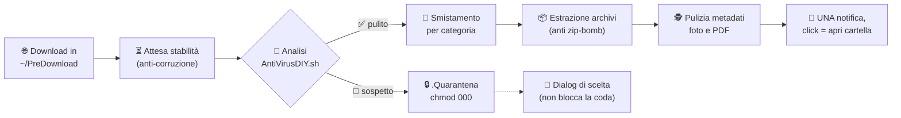

<div align="center">

# 🛡️ MusiGuard

### Il guardiano automatico dei tuoi download su Linux

*Intercetta ogni file appena scaricato, lo analizza, mette in quarantena i sospetti,
smista i file puliti nella cartella giusta e ti disturba solo quando serve davvero.*

[](https://www.gnu.org/software/bash/)
[](https://www.debian.org/)
[](https://systemd.io/)
[](https://www.clamav.net/)
[-394EFF)](https://www.virustotal.com/)

</div>

---

## 🗺️ Come funziona

Il browser scarica in `~/PreDownload` (idealmente un volume separato montato `noexec`: nulla può essere eseguito da lì, nemmeno per sbaglio — lo crea per te lo script opzionale `crea-disco-predownload.sh`, vedi installazione). Da quel momento fa tutto MusiGuard, in background:



L'analisi combina, in ordine: **MIME vs estensione**, **anti-spoofing del nome**, **SHA256 dagli appunti**, **ClamAV** e — se configurato — **VirusTotal**. Ogni file riceve **una sola notifica** a lavoro finito; i download successivi non aspettano mai le tue decisioni.

## 🚀 Caratteristiche

### 🛡️ Sicurezza multi-livello

| Difesa | Cosa fa |
|---|---|
| **MIME vs estensione** | Rileva eseguibili nascosti — Linux (ELF/script) **e Windows (PE)** — camuffati da `.pdf`, `.jpg`, ecc. |
| **Anti-spoofing del nome** | Smaschera doppie estensioni ingannevoli (`fattura.pdf.exe`, spazi di riempimento inclusi) e caratteri Unicode invisibili/direzionali (trucco RTLO che inverte il nome mostrato). |
| **SHA256 dagli appunti** | Se hai copiato l'hash dal sito del download, viene confrontato in automatico. Niente popup: se negli appunti non c'è un hash, non succede (e non si calcola) nulla. |
| **Scansione ClamAV** | Usa `clamdscan` (istantaneo, firme in memoria) se il demone è installato, altrimenti `clamscan`. |
| **Quarantena vera** | Il sospetto va subito in `~/PreDownload/.Quarantena` (sul volume `noexec`) con permessi `000` e motivo in `quarantena.log`. La finestra di scelta (elimina / lascia / ignora e smista) arriva dopo, **senza bloccare** la coda. |
| **VirusTotal** *(opzionale)* | Lookup del **solo hash SHA256** su API v3: il file non lascia mai il PC. 70+ motori dove ClamAV da solo arriva corto. Senza chiave o senza rete il modulo tace e non blocca nulla. |

### 📂 Automazione dei file

- **Smistamento per estensione** — ogni file nella cartella giusta (Documenti, Immagini, Video, Musica, Archivi, Stampa 3D), collisioni gestite con suffissi `(1)`, `(2)`, … Modulo opzionale: senza, l'antivirus controlla i file e li lascia in `~/Downloads`.
- **Estrazione automatica e sicura** — archivi (`zip`, `tar.*`, `tgz`, `rar`, `7z`) e compressi singoli (`gz`, `bz2`, `xz`, `zst`) estratti in background in sottocartelle dedicate, con protezione **anti zip-bomb** (`MAX_ESTRAZIONE_MB`). A estrazione riuscita l'originale viene eliminato.
- **Privacy anti-tracking** — via `exiftool`, rimozione dei metadati traccianti (GPS, autore, software) da foto e PDF smistati, conservando orientamento e profilo colore. Si spegne da solo se `exiftool` manca.
- **Anti-corruzione** — un download ancora in corso non viene mai spostato troncato: si procede solo a dimensione stabile.
- **Pulizia settimanale** — svuota il Cestino di sistema una volta a settimana (modulo opzionale, spento di default). La domanda "svuoto la Quarantena?" arriva invece **sempre**, una volta a settimana, con l'elenco dei file sospetti accumulati: non è disattivabile.

### 🔒 Robustezza

`set -u` + shellcheck su tutti gli script · lock `flock` contro le istanze doppie · log con rotazione integrata · riavvio automatico via systemd (`Restart=on-failure`).

## 🛠️ Installazione

**1. Prerequisiti**

```bash
sudo apt update
sudo apt install -y inotify-tools clamav zenity libnotify-bin \
    tar unzip unrar p7zip-full wl-clipboard
# Consigliati: clamav-daemon (scansioni istantanee), zstd (archivi .zst),
# libimage-exiftool-perl (pulizia metadati), curl + jq (VirusTotal)
sudo apt install -y clamav-daemon zstd libimage-exiftool-perl curl jq
```

> Su X11 al posto di `wl-clipboard` serve `xclip`.

**2. Clona e installa**

```bash
git clone https://github.com/franmuzi1/Musiguard.git ~/MusiGuard
cd ~/MusiGuard
chmod +x installa-servizio.sh scripts/*.sh
./installa-servizio.sh
```

Alla **prima installazione** partono le configurazioni guidate, in ordine: prima quella del **volume virtuale isolato** (vedi passo 4), poi il **wizard dei moduli**. Il modulo base è l'**antivirus**: da solo non smista, si assicura solo che i file scaricati non siano pericolosi e li passa in `~/Downloads`.

**3. Punta il browser su `~/PreDownload`** al posto di `~/Downloads`. Fatto. 🎉

**4. *(Opzionale, consigliato)* Volume virtuale isolato** — alla prima installazione parte la **configurazione guidata**: trasforma `~/PreDownload` in un volume separato dove nulla può essere eseguito, nemmeno per sbaglio. È un'immagine *elastica*: la dimensione scelta è solo un tetto virtuale (100GB dichiarati **non** occupano davvero 100GB — sul disco pesa solo quanto i file presenti), montata con `noexec,nosuid,nodev` a ogni avvio. Se l'hai saltata, o per cambiare dimensione (l'immagine esistente non viene mai riformattata):

```bash
sudo ~/MusiGuard/scripts/crea-disco-predownload.sh        # default 50GB
sudo ~/MusiGuard/scripts/crea-disco-predownload.sh 100    # dimensione a scelta
```

> Non spostare e non cestinare mai `~/pre_download_disk.img`: è il disco della quarantena.

## ⚙️ Configurazione

Riconfigurabile in qualsiasi momento con il wizard (`./scripts/configura.sh`) oppure a mano in `~/.config/musiguard.conf` — solo righe `CHIAVE=numero`, il file viene **letto e mai eseguito**. Dopo una modifica a mano: `systemctl --user restart musiguard-guardiano`.

| Chiave | Default | Effetto |
|---|:---:|---|
| `ATTIVA_GUARDIANO` | `1` | Demone di sorveglianza su `~/PreDownload` |
| `CHIEDI_SHA` | `1` | Confronto SHA256 con l'hash negli appunti |
| `CONTROLLO_VT` | `1` | Seconda opinione VirusTotal (serve la chiave, vedi sotto) |
| `ESTRAI_ARCHIVI` | `1` | Estrazione automatica degli archivi |
| `SMISTA_ESTENSIONE` | `1` | Smistamento nelle cartelle per categoria |
| `PULISCI_METADATI` | `1` | Rimozione metadati da foto e PDF |
| `SVUOTA_CESTINO` | `0` | Svuota il Cestino di sistema una volta a settimana (distruttivo: spento di default) |
| `MAX_ESTRAZIONE_MB` | `10240` | Tetto anti zip-bomb sulla dimensione decompressa |

> La domanda settimanale "svuoto la Quarantena?" **non** è tra queste chiavi: arriva sempre (`musiguard-cestino.timer`), a prescindere da `SVUOTA_CESTINO`.

<details>
<summary><b>🔑 Attivare VirusTotal</b></summary>

<br/>

1. Account gratuito su [virustotal.com](https://www.virustotal.com), poi menu profilo → **API key**.
2. Salva la chiave (64 caratteri esadecimali):

```bash
echo LA_TUA_CHIAVE > ~/.config/musiguard-vt.key
chmod 600 ~/.config/musiguard-vt.key
```

Attivo da subito, nessun riavvio necessario. **Privacy e limiti:** viaggia solo l'hash del file, mai il contenuto; il piano gratuito consente 4 richieste al minuto — se scarichi a raffica le richieste in eccesso vengono semplicemente saltate (resta la copertura ClamAV).

</details>

## 📂 Struttura del progetto

<details>
<summary>Mostra l'albero dei file</summary>

<br/>

```
MusiGuard/
├── installa-servizio.sh               # ⭐ Punto d'ingresso: installa/aggiorna le unit systemd
├── scripts/
│   ├── guardiano-download.sh          # Il demone in ascolto su ~/PreDownload
│   ├── AntiVirusDIY.sh                # Motore di scansione (MIME, nome, SHA256, ClamAV, VT)
│   ├── crea-disco-predownload.sh      # Opzionale: disco elastico noexec per ~/PreDownload
│   ├── pulizia-cestino.sh             # Pulizia settimanale: Cestino + domanda Quarantena
│   └── configura.sh                   # Wizard di scelta dei moduli (primo avvio e on-demand)
└── systemd/
    ├── musiguard-guardiano.service    # Servizio del guardiano (Restart=on-failure)
    ├── musiguard-cestino.service      # Oneshot: eseguito solo dal timer sotto
    └── musiguard-cestino.timer        # Fa scattare la pulizia una volta a settimana
```

</details>

## 🔍 Comandi utili

| Comando | Cosa mostra |
|---|---|
| `journalctl --user -u musiguard-guardiano -f` | Log del guardiano in diretta |
| `cat ~/MusiGuard/estrazioni.log` | Esiti delle estrazioni |
| `cat ~/MusiGuard/quarantena.log` | Storia della quarantena (file e motivi) |
| `ls -la ~/PreDownload/.Quarantena` | Cosa c'è in quarantena adesso |
| `cat ~/MusiGuard/cestino.log` | Storia della pulizia settimanale del Cestino |
| `systemctl --user list-timers musiguard-cestino.timer` | Quando scatta il prossimo giro di pulizia |
| `systemctl --user start musiguard-cestino.service` | Forza subito un giro di pulizia (senza aspettare il timer) |

---

<div align="center">

*Fatto in Bash, con paranoia e affetto.* 🐚

</div>
